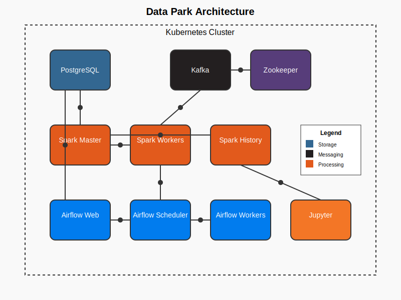

# Data Park Architecture

This document provides an overview of the Data Park architecture and how the different components interact with each other.

## System Overview

Data Park is a comprehensive local training environment for data engineering, consisting of the following core components:

- **Apache Spark** - For batch and stream processing
- **Apache Kafka** - For event streaming
- **PostgreSQL** - For data storage and management
- **Apache Airflow** - For workflow orchestration
- **Jupyter Notebook** - For interactive development

## Component Architecture

### Apache Spark

The Spark cluster consists of:

- **Spark Master** - Coordinates the execution of Spark applications
- **Spark Workers** (2-3 instances) - Execute tasks assigned by the master
- **Spark History Server** - Provides a web UI for monitoring completed Spark applications

Spark is configured to work with:
- JDBC connection to PostgreSQL for data ingestion and storage
- Kafka Streaming for real-time data processing
- Integrated with Airflow for workflow orchestration

### Apache Kafka

The Kafka messaging system includes:

- **Zookeeper** - Manages the Kafka cluster state
- **Kafka Brokers** (3 instances) - Handle message storage and delivery
- **Topic Configuration** - Pre-configured topics for customer events, product events, order events, and clickstream data

### PostgreSQL

The PostgreSQL database is configured with:

- **Multiple Databases** - For Airflow metadata and data processing
- **Schemas** - Raw and processed data schemas for ETL/ELT workflows
- **Sample Tables** - Pre-defined table structures for customers, products, orders, etc.
- **User Roles** - Different user roles for Airflow, Spark, and other components

### Apache Airflow

The Airflow orchestration platform consists of:

- **Webserver** - Provides the web UI for DAG management
- **Scheduler** - Schedules and triggers workflow execution
- **Workers** (2-3 instances) - Execute the tasks
- **Redis** - Used as a message broker for the Celery executor
- **Integration** - Pre-configured connections to Spark, Kafka, and PostgreSQL

### Jupyter Notebook

The Jupyter environment includes:

- **Notebook Server** - For interactive code development
- **Sample Notebooks** - Pre-configured notebooks for Spark batch processing, Kafka streaming, and PostgreSQL connections
- **Python Libraries** - Pre-installed data engineering libraries

## Data Flow

### Batch Processing Flow

1. Raw data is stored in PostgreSQL or files
2. Airflow triggers Spark batch jobs on a schedule
3. Spark processes the data and stores results in PostgreSQL
4. Results can be analyzed in Jupyter notebooks

### Streaming Processing Flow

1. Events are generated and sent to Kafka topics
2. Spark Streaming consumes the events in real-time
3. Processed results are stored in PostgreSQL or other sinks
4. Aggregated metrics can be visualized in notebooks or dashboards

### ETL/ELT Workflows

1. Airflow orchestrates the entire ETL/ELT process
2. Data is extracted from source systems (simulated in PostgreSQL)
3. Transformation is performed using Spark
4. Results are loaded back to the target data store
5. Data quality checks and monitoring are performed

## Integration Points

- **Spark ↔ PostgreSQL**: JDBC connection for data reading/writing
- **Spark ↔ Kafka**: Streaming integration for real-time processing
- **Airflow ↔ Spark**: Task submission and monitoring
- **Airflow ↔ PostgreSQL**: Metadata storage and data processing
- **Jupyter ↔ All Components**: For interactive exploration and development

## Kubernetes Infrastructure

All components are deployed as containers in Kubernetes, with proper:
- Resource management (CPU/memory limits and requests)
- Persistent storage for data retention
- Service discovery for component communication
- Networking policies for security
- Ingress for external access

## Security Considerations

For local development, security is simplified, but the environment still includes:
- Basic authentication for web interfaces
- Separate database users with appropriate permissions
- Network policies to control inter-service communication

## Scalability

While designed for local development, the architecture can be scaled by:
- Increasing the number of Spark workers
- Increasing the number of Kafka brokers
- Adjusting resource allocations for containers
- Implementing additional monitoring and logging

## Future Enhancements

Potential enhancements to the architecture include:
- Adding monitoring with Prometheus and Grafana
- Implementing data quality frameworks
- Adding data visualization tools
- Integrating with S3-compatible storage
- Implementing schema registry for Kafka
